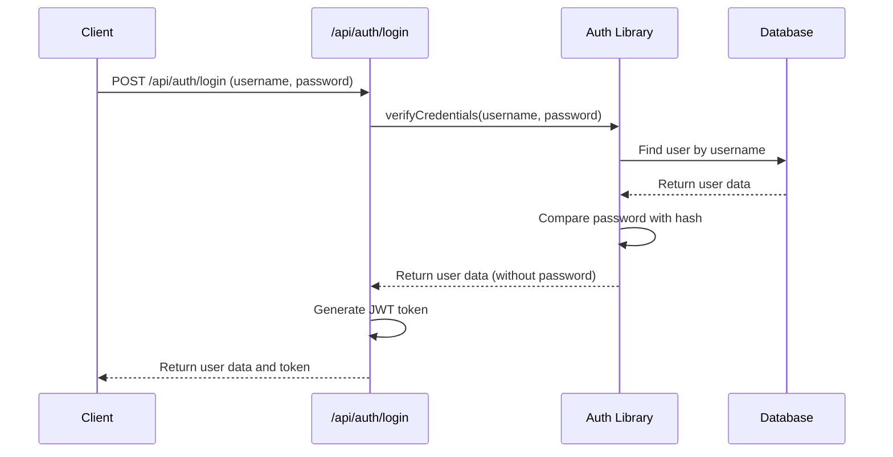
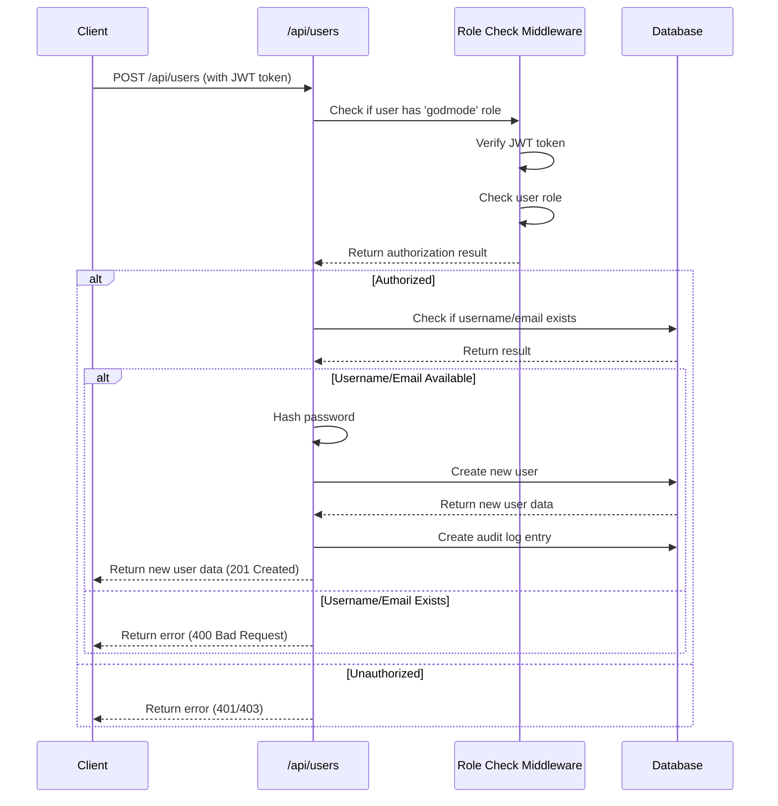
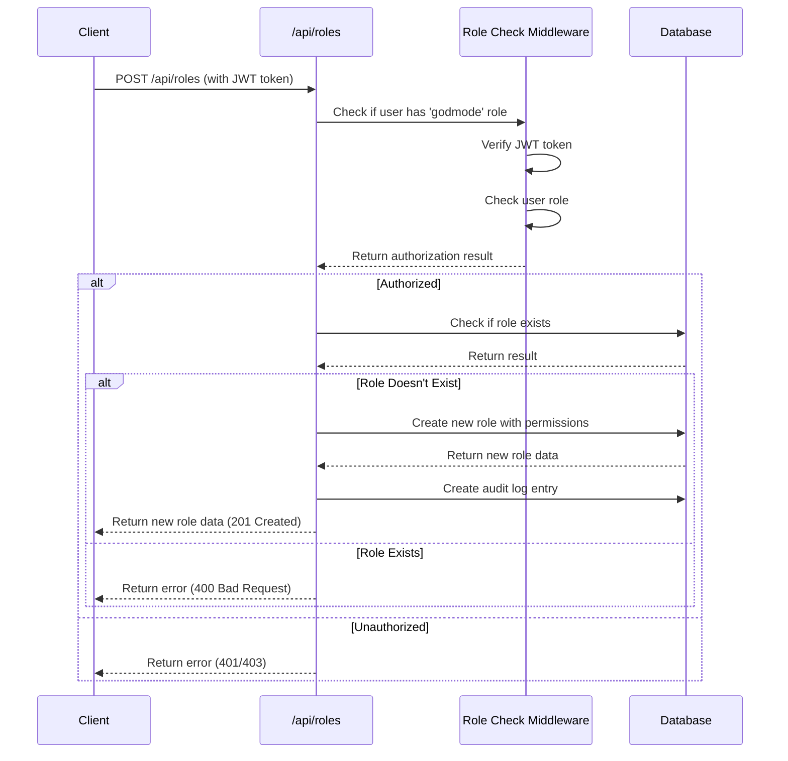
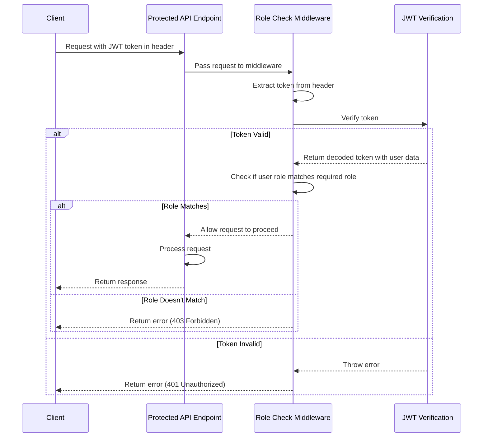

# SW-Vista Authentication and User Management System Documentation

## 1. System Overview

The SW-Vista application implements a comprehensive authentication and user management system that provides secure access control, user administration, and role-based permissions. This system is designed to ensure that users can only access resources and perform actions that they are authorized for.

### Key Components

- **Authentication**: Verifies user identity through username/password credentials
- **Authorization**: Controls access to resources based on user roles and permissions
- **User Management**: Handles user creation, updates, and deletion
- **Role Management**: Defines and manages user roles and their associated permissions
- **Audit Logging**: Tracks important system actions for security and compliance

### Security Features

- Password hashing using bcrypt
- JWT (JSON Web Token) for stateless authentication
- Role-based access control
- Permission-based authorization
- Comprehensive audit logging

## 2. Architecture Documentation

### Authentication Flow

The authentication system uses a token-based approach with JWT (JSON Web Tokens):

1. User submits username and password to the login endpoint
2. System verifies credentials against the database
3. If valid, a JWT token is generated containing user ID, username, and role
4. Token is returned to the client and stored for subsequent requests
5. For protected endpoints, the token is included in the Authorization header
6. Middleware verifies the token and checks if the user has the required role

### User Creation and Management

User management is restricted to administrators with the 'godmode' role:

1. Administrators can create new users with username, email, password, and role
2. Passwords are hashed using bcrypt before storage
3. User information can be updated, including changing passwords
4. Users can be deleted from the system
5. All user management actions are logged in the audit log

### Role-Based Access Control System

The system implements role-based access control (RBAC):

1. Each user is assigned a role (e.g., 'user', 'admin', 'godmode')
2. Roles define what actions a user can perform in the system
3. Protected endpoints check if the user has the required role
4. Only users with the 'godmode' role can manage roles and permissions

### Permission Management

Permissions provide fine-grained access control:

1. Each role has a set of permissions
2. Permissions define specific actions that can be performed
3. The system checks if a user's role has the required permission
4. Permissions can be added to or removed from roles
5. Only users with the 'godmode' role can manage permissions

### Audit Logging

The system maintains an audit log of important actions:

1. User creation, updates, and deletion
2. Role creation, updates, and deletion
3. Permission changes
4. Each log entry includes the user who performed the action, the affected entity, the action type, and a timestamp

## 3. Database Schema

### Users Model

```prisma
model Users {
  id            Int                  @id @default(autoincrement())
  username      String               @unique
  email         String               @unique
  password_hash String
  role          String
  created_at    DateTime             @default(now())
  // Relationships with other models
  feedbacks     EventFeedback[]
  proposals     Proposals[]          @relation("UserProposals")
  notifications CalendarNotifications[]
  auditLogs     AuditLogs[]
  bookings      VenueBookings[]
  reports       Reports[]            @relation("ReporterReports")
  approvals     Approvals[]          @relation("ApproverApprovals")
  clubMembers   ClubMembers[]
}
```

### UserRoles Model

```prisma
model UserRoles {
  id          Int      @id @default(autoincrement())
  role_name   String   @unique
  permissions String[] // Array of permissions
}
```

### Relationships with Other Models

The Users model has relationships with several other models in the system:
- EventFeedback: User feedback on events
- Proposals: Event proposals submitted by users
- CalendarNotifications: Notifications for users
- AuditLogs: System action logs
- VenueBookings: Venue bookings made by users
- Reports: Reports submitted by users
- Approvals: Approvals made by users
- ClubMembers: Club memberships

## 4. API Endpoints Documentation

### Authentication Endpoints

#### POST /api/auth/login
Authenticates a user and returns a JWT token.

**Request Body:**
```json
{
  "username": "string",
  "password": "string"
}
```

**Response (200 OK):**
```json
{
  "user": {
    "id": "number",
    "username": "string",
    "email": "string",
    "role": "string",
    "created_at": "string"
  },
  "token": "string"
}
```

**Error Responses:**
- 400 Bad Request: Username and password are required
- 401 Unauthorized: Invalid credentials
- 500 Internal Server Error: Error during login

### User Management Endpoints

#### GET /api/users
Returns a list of all users. Excludes password hashes for security.

**Response (200 OK):**
```json
[
  {
    "id": "number",
    "username": "string",
    "email": "string",
    "role": "string",
    "created_at": "string"
  }
]
```

**Error Responses:**
- 500 Internal Server Error: Error fetching users

#### POST /api/users
Creates a new user. Requires 'godmode' role.

**Request Body:**
```json
{
  "username": "string",
  "email": "string",
  "password": "string",
  "role": "string"
}
```

**Response (201 Created):**
```json
{
  "id": "number",
  "username": "string",
  "email": "string",
  "role": "string",
  "created_at": "string"
}
```

**Error Responses:**
- 400 Bad Request: Missing required fields or username/email already exists
- 401 Unauthorized: Missing or invalid token
- 403 Forbidden: Insufficient permissions
- 500 Internal Server Error: Error creating user

#### GET /api/users/:id
Returns a specific user by ID. Excludes password hash for security.

**Response (200 OK):**
```json
{
  "id": "number",
  "username": "string",
  "email": "string",
  "role": "string",
  "created_at": "string"
}
```

**Error Responses:**
- 404 Not Found: User not found
- 500 Internal Server Error: Error fetching user

#### PUT /api/users/:id
Updates a user. Requires 'godmode' role.

**Request Body:**
```json
{
  "username": "string", // optional
  "email": "string", // optional
  "password": "string", // optional
  "role": "string" // optional
}
```

**Response (200 OK):**
```json
{
  "id": "number",
  "username": "string",
  "email": "string",
  "role": "string",
  "created_at": "string"
}
```

**Error Responses:**
- 401 Unauthorized: Missing or invalid token
- 403 Forbidden: Insufficient permissions
- 404 Not Found: User not found
- 500 Internal Server Error: Error updating user

#### DELETE /api/users/:id
Deletes a user. Requires 'godmode' role.

**Response (200 OK):**
```json
{
  "message": "User deleted successfully"
}
```

**Error Responses:**
- 401 Unauthorized: Missing or invalid token
- 403 Forbidden: Insufficient permissions
- 404 Not Found: User not found
- 500 Internal Server Error: Error deleting user

### Role Management Endpoints

#### GET /api/roles
Returns a list of all roles.

**Response (200 OK):**
```json
[
  {
    "id": "number",
    "role_name": "string",
    "permissions": ["string"]
  }
]
```

**Error Responses:**
- 500 Internal Server Error: Error fetching roles

#### POST /api/roles
Creates a new role. Requires 'godmode' role.

**Request Body:**
```json
{
  "role_name": "string",
  "permissions": ["string"]
}
```

**Response (201 Created):**
```json
{
  "id": "number",
  "role_name": "string",
  "permissions": ["string"]
}
```

**Error Responses:**
- 400 Bad Request: Missing or invalid required fields or role already exists
- 401 Unauthorized: Missing or invalid token
- 403 Forbidden: Insufficient permissions
- 500 Internal Server Error: Error creating role

#### GET /api/roles/:id
Returns a specific role by ID.

**Response (200 OK):**
```json
{
  "id": "number",
  "role_name": "string",
  "permissions": ["string"]
}
```

**Error Responses:**
- 404 Not Found: Role not found
- 500 Internal Server Error: Error fetching role

#### PUT /api/roles/:id
Updates a role. Requires 'godmode' role.

**Request Body:**
```json
{
  "role_name": "string", // optional
  "permissions": ["string"] // optional
}
```

**Response (200 OK):**
```json
{
  "id": "number",
  "role_name": "string",
  "permissions": ["string"]
}
```

**Error Responses:**
- 401 Unauthorized: Missing or invalid token
- 403 Forbidden: Insufficient permissions
- 404 Not Found: Role not found
- 500 Internal Server Error: Error updating role

#### DELETE /api/roles/:id
Deletes a role. Requires 'godmode' role.

**Response (200 OK):**
```json
{
  "message": "Role deleted successfully"
}
```

**Error Responses:**
- 401 Unauthorized: Missing or invalid token
- 403 Forbidden: Insufficient permissions
- 404 Not Found: Role not found
- 500 Internal Server Error: Error deleting role

### Permission Management Endpoints

#### GET /api/permissions
Returns a list of all permissions in the system.

**Response (200 OK):**
```json
["string"]
```

**Error Responses:**
- 500 Internal Server Error: Error fetching permissions

#### POST /api/permissions
Adds a permission to a role. Requires 'godmode' role.

**Request Body:**
```json
{
  "role_id": "number",
  "permission": "string"
}
```

**Response (200 OK):**
```json
{
  "id": "number",
  "role_name": "string",
  "permissions": ["string"]
}
```

**Error Responses:**
- 400 Bad Request: Missing required fields or permission already exists in role
- 401 Unauthorized: Missing or invalid token
- 403 Forbidden: Insufficient permissions
- 404 Not Found: Role not found
- 500 Internal Server Error: Error adding permission

#### GET /api/roles/:id/permissions
Returns permissions for a specific role.

**Response (200 OK):**
```json
["string"]
```

**Error Responses:**
- 404 Not Found: Role not found
- 500 Internal Server Error: Error fetching permissions

## 5. Sequence Diagrams

### Login Process



### User Creation Process



### Role and Permission Assignment



### Authorization Flow



## 6. Postman Test Cases

### Authentication Tests

#### 1. Login with Valid Credentials

**Request:**
- Method: POST
- URL: {{base_url}}/api/auth/login
- Body:
```json
{
  "username": "admin",
  "password": "adminpassword"
}
```

**Tests:**
```javascript
pm.test("Status code is 200", function () {
    pm.response.to.have.status(200);
});

pm.test("Response has user and token", function () {
    var jsonData = pm.response.json();
    pm.expect(jsonData).to.have.property('user');
    pm.expect(jsonData).to.have.property('token');
    pm.expect(jsonData.user).to.have.property('id');
    pm.expect(jsonData.user).to.have.property('username');
    pm.expect(jsonData.user).to.have.property('email');
    pm.expect(jsonData.user).to.have.property('role');
    
    // Save token for other requests
    pm.environment.set("auth_token", jsonData.token);
});
```

#### 2. Login with Invalid Credentials

**Request:**
- Method: POST
- URL: {{base_url}}/api/auth/login
- Body:
```json
{
  "username": "admin",
  "password": "wrongpassword"
}
```

**Tests:**
```javascript
pm.test("Status code is 401", function () {
    pm.response.to.have.status(401);
});

pm.test("Response has error message", function () {
    var jsonData = pm.response.json();
    pm.expect(jsonData).to.have.property('message');
    pm.expect(jsonData.message).to.equal('Invalid credentials');
});
```

#### 3. Login with Missing Fields

**Request:**
- Method: POST
- URL: {{base_url}}/api/auth/login
- Body:
```json
{
  "username": "admin"
}
```

**Tests:**
```javascript
pm.test("Status code is 400", function () {
    pm.response.to.have.status(400);
});

pm.test("Response has error message", function () {
    var jsonData = pm.response.json();
    pm.expect(jsonData).to.have.property('message');
    pm.expect(jsonData.message).to.equal('Username and password are required');
});
```

### User Management Tests

#### 1. Get All Users

**Request:**
- Method: GET
- URL: {{base_url}}/api/users
- Headers:
  - Authorization: Bearer {{auth_token}}

**Tests:**
```javascript
pm.test("Status code is 200", function () {
    pm.response.to.have.status(200);
});

pm.test("Response is an array of users", function () {
    var jsonData = pm.response.json();
    pm.expect(jsonData).to.be.an('array');
    if (jsonData.length > 0) {
        pm.expect(jsonData[0]).to.have.property('id');
        pm.expect(jsonData[0]).to.have.property('username');
        pm.expect(jsonData[0]).to.have.property('email');
        pm.expect(jsonData[0]).to.have.property('role');
        pm.expect(jsonData[0]).to.not.have.property('password_hash');
    }
});
```

#### 2. Create New User (as godmode)

**Request:**
- Method: POST
- URL: {{base_url}}/api/users
- Headers:
  - Authorization: Bearer {{godmode_token}}
- Body:
```json
{
  "username": "newuser",
  "email": "newuser@example.com",
  "password": "password123",
  "role": "user"
}
```

**Tests:**
```javascript
pm.test("Status code is 201", function () {
    pm.response.to.have.status(201);
});

pm.test("Response has user data", function () {
    var jsonData = pm.response.json();
    pm.expect(jsonData).to.have.property('id');
    pm.expect(jsonData).to.have.property('username');
    pm.expect(jsonData.username).to.equal('newuser');
    pm.expect(jsonData).to.have.property('email');
    pm.expect(jsonData.email).to.equal('newuser@example.com');
    pm.expect(jsonData).to.have.property('role');
    pm.expect(jsonData.role).to.equal('user');
    pm.expect(jsonData).to.not.have.property('password_hash');
    
    // Save user ID for other tests
    pm.environment.set("new_user_id", jsonData.id);
});
```

#### 3. Create User with Existing Username

**Request:**
- Method: POST
- URL: {{base_url}}/api/users
- Headers:
  - Authorization: Bearer {{godmode_token}}
- Body:
```json
{
  "username": "newuser",
  "email": "different@example.com",
  "password": "password123",
  "role": "user"
}
```

**Tests:**
```javascript
pm.test("Status code is 400", function () {
    pm.response.to.have.status(400);
});

pm.test("Response has error message", function () {
    var jsonData = pm.response.json();
    pm.expect(jsonData).to.have.property('message');
    pm.expect(jsonData.message).to.equal('Username or email already exists');
});
```

#### 4. Get User by ID

**Request:**
- Method: GET
- URL: {{base_url}}/api/users/{{new_user_id}}
- Headers:
  - Authorization: Bearer {{auth_token}}

**Tests:**
```javascript
pm.test("Status code is 200", function () {
    pm.response.to.have.status(200);
});

pm.test("Response has user data", function () {
    var jsonData = pm.response.json();
    pm.expect(jsonData).to.have.property('id');
    pm.expect(jsonData.id).to.equal(parseInt(pm.environment.get("new_user_id")));
    pm.expect(jsonData).to.have.property('username');
    pm.expect(jsonData).to.have.property('email');
    pm.expect(jsonData).to.have.property('role');
    pm.expect(jsonData).to.not.have.property('password_hash');
});
```

#### 5. Update User

**Request:**
- Method: PUT
- URL: {{base_url}}/api/users/{{new_user_id}}
- Headers:
  - Authorization: Bearer {{godmode_token}}
- Body:
```json
{
  "email": "updated@example.com",
  "role": "admin"
}
```

**Tests:**
```javascript
pm.test("Status code is 200", function () {
    pm.response.to.have.status(200);
});

pm.test("Response has updated user data", function () {
    var jsonData = pm.response.json();
    pm.expect(jsonData).to.have.property('id');
    pm.expect(jsonData.id).to.equal(parseInt(pm.environment.get("new_user_id")));
    pm.expect(jsonData).to.have.property('username');
    pm.expect(jsonData.username).to.equal('newuser');
    pm.expect(jsonData).to.have.property('email');
    pm.expect(jsonData.email).to.equal('updated@example.com');
    pm.expect(jsonData).to.have.property('role');
    pm.expect(jsonData.role).to.equal('admin');
});
```

#### 6. Delete User

**Request:**
- Method: DELETE
- URL: {{base_url}}/api/users/{{new_user_id}}
- Headers:
  - Authorization: Bearer {{godmode_token}}

**Tests:**
```javascript
pm.test("Status code is 200", function () {
    pm.response.to.have.status(200);
});

pm.test("Response has success message", function () {
    var jsonData = pm.response.json();
    pm.expect(jsonData).to.have.property('message');
    pm.expect(jsonData.message).to.equal('User deleted successfully');
});
```

### Role Management Tests

#### 1. Get All Roles

**Request:**
- Method: GET
- URL: {{base_url}}/api/roles
- Headers:
  - Authorization: Bearer {{auth_token}}

**Tests:**
```javascript
pm.test("Status code is 200", function () {
    pm.response.to.have.status(200);
});

pm.test("Response is an array of roles", function () {
    var jsonData = pm.response.json();
    pm.expect(jsonData).to.be.an('array');
    if (jsonData.length > 0) {
        pm.expect(jsonData[0]).to.have.property('id');
        pm.expect(jsonData[0]).to.have.property('role_name');
        pm.expect(jsonData[0]).to.have.property('permissions');
        pm.expect(jsonData[0].permissions).to.be.an('array');
    }
});
```

#### 2. Create New Role

**Request:**
- Method: POST
- URL: {{base_url}}/api/roles
- Headers:
  - Authorization: Bearer {{godmode_token}}
- Body:
```json
{
  "role_name": "editor",
  "permissions": ["read", "write", "edit"]
}
```

**Tests:**
```javascript
pm.test("Status code is 201", function () {
    pm.response.to.have.status(201);
});

pm.test("Response has role data", function () {
    var jsonData = pm.response.json();
    pm.expect(jsonData).to.have.property('id');
    pm.expect(jsonData).to.have.property('role_name');
    pm.expect(jsonData.role_name).to.equal('editor');
    pm.expect(jsonData).to.have.property('permissions');
    pm.expect(jsonData.permissions).to.be.an('array');
    pm.expect(jsonData.permissions).to.include('read');
    pm.expect(jsonData.permissions).to.include('write');
    pm.expect(jsonData.permissions).to.include('edit');
    
    // Save role ID for other tests
    pm.environment.set("new_role_id", jsonData.id);
});
```

#### 3. Get Role by ID

**Request:**
- Method: GET
- URL: {{base_url}}/api/roles/{{new_role_id}}
- Headers:
  - Authorization: Bearer {{auth_token}}

**Tests:**
```javascript
pm.test("Status code is 200", function () {
    pm.response.to.have.status(200);
});

pm.test("Response has role data", function () {
    var jsonData = pm.response.json();
    pm.expect(jsonData).to.have.property('id');
    pm.expect(jsonData.id).to.equal(parseInt(pm.environment.get("new_role_id")));
    pm.expect(jsonData).to.have.property('role_name');
    pm.expect(jsonData.role_name).to.equal('editor');
    pm.expect(jsonData).to.have.property('permissions');
    pm.expect(jsonData.permissions).to.be.an('array');
});
```

#### 4. Update Role

**Request:**
- Method: PUT
- URL: {{base_url}}/api/roles/{{new_role_id}}
- Headers:
  - Authorization: Bearer {{godmode_token}}
- Body:
```json
{
  "permissions": ["read", "write", "edit", "delete"]
}
```

**Tests:**
```javascript
pm.test("Status code is 200", function () {
    pm.response.to.have.status(200);
});

pm.test("Response has updated role data", function () {
    var jsonData = pm.response.json();
    pm.expect(jsonData).to.have.property('id');
    pm.expect(jsonData.id).to.equal(parseInt(pm.environment.get("new_role_id")));
    pm.expect(jsonData).to.have.property('role_name');
    pm.expect(jsonData.role_name).to.equal('editor');
    pm.expect(jsonData).to.have.property('permissions');
    pm.expect(jsonData.permissions).to.be.an('array');
    pm.expect(jsonData.permissions).to.include('delete');
});
```

#### 5. Get Role Permissions

**Request:**
- Method: GET
- URL: {{base_url}}/api/roles/{{new_role_id}}/permissions
- Headers:
  - Authorization: Bearer {{auth_token}}

**Tests:**
```javascript
pm.test("Status code is 200", function () {
    pm.response.to.have.status(200);
});

pm.test("Response is an array of permissions", function () {
    var jsonData = pm.response.json();
    pm.expect(jsonData).to.be.an('array');
    pm.expect(jsonData).to.include('read');
    pm.expect(jsonData).to.include('write');
    pm.expect(jsonData).to.include('edit');
    pm.expect(jsonData).to.include('delete');
});
```

#### 6. Add Permission to Role

**Request:**
- Method: POST
- URL: {{base_url}}/api/permissions
- Headers:
  - Authorization: Bearer {{godmode_token}}
- Body:
```json
{
  "role_id": "{{new_role_id}}",
  "permission": "approve"
}
```

**Tests:**
```javascript
pm.test("Status code is 200", function () {
    pm.response.to.have.status(200);
});

pm.test("Response has updated role with new permission", function () {
    var jsonData = pm.response.json();
    pm.expect(jsonData).to.have.property('id');
    pm.expect(jsonData.id).to.equal(parseInt(pm.environment.get("new_role_id")));
    pm.expect(jsonData).to.have.property('permissions');
    pm.expect(jsonData.permissions).to.be.an('array');
    pm.expect(jsonData.permissions).to.include('approve');
});
```

#### 7. Delete Role

**Request:**
- Method: DELETE
- URL: {{base_url}}/api/roles/{{new_role_id}}
- Headers:
  - Authorization: Bearer {{godmode_token}}

**Tests:**
```javascript
pm.test("Status code is 200", function () {
    pm.response.to.have.status(200);
});

pm.test("Response has success message", function () {
    var jsonData = pm.response.json();
    pm.expect(jsonData).to.have.property('message');
    pm.expect(jsonData.message).to.equal('Role deleted successfully');
});
```

## 7. Security Considerations

### Password Hashing

The system uses bcrypt for secure password hashing:

- Passwords are never stored in plain text
- bcrypt automatically includes salt for protection against rainbow table attacks
- A salt rounds value of 10 is used, which provides a good balance between security and performance
- Password hashing is performed during user creation and password updates

### JWT Token Security

JWT tokens are used for authentication:

- Tokens include user ID, username, and role for authorization
- Tokens are signed with a secret key to prevent tampering
- Tokens have an expiration time (1 day) to limit the window of opportunity for attacks
- The JWT secret should be stored in environment variables and not hardcoded

### Role-Based Access Control

The system implements role-based access control:

- Each endpoint that requires authorization uses the roleCheck middleware
- The middleware verifies the JWT token and checks if the user has the required role
- Only users with the 'godmode' role can manage users, roles, and permissions
- This ensures that sensitive operations are restricted to authorized users

### Audit Logging

The system maintains comprehensive audit logs:

- All important actions are logged, including user and role management
- Each log entry includes the user who performed the action, the affected entity, the action type, and a timestamp
- This provides accountability and helps with security incident investigations
- Logs can be used for compliance purposes and to detect suspicious activity

### Security Best Practices

The system follows security best practices:

- Input validation for all API endpoints
- Error handling that doesn't expose sensitive information
- Password hashing with bcrypt
- JWT for stateless authentication
- Role-based access control
- Audit logging for accountability
- Proper HTTP status codes for different error conditions
